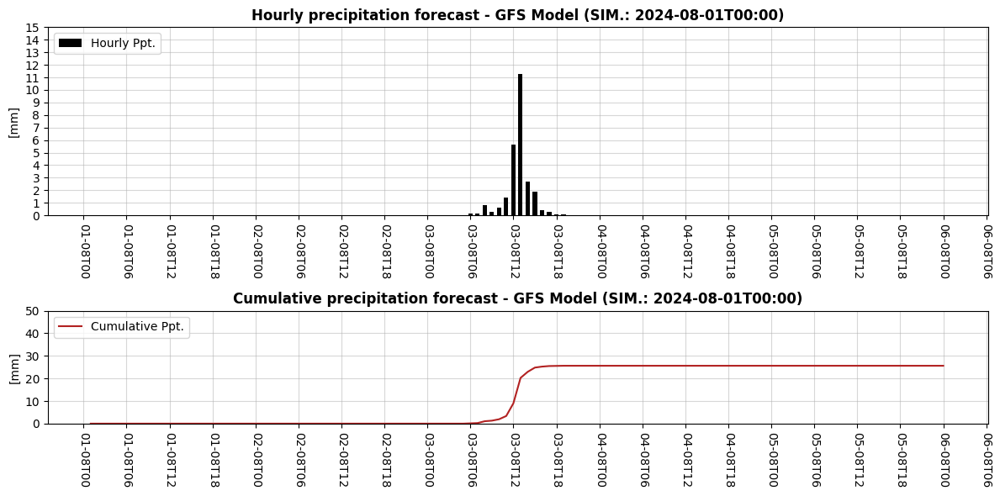

### Project Overview

Hello again! Welcome to the continuation of our deep dive into precipitation forecasting using the GFS dataset and the GEE Python API. In our previous post, we demonstrated how to use the GEE Python API along with the XEE library (an integration of GEE and xarray) to forecast precipitation for specific coordinates. This time, we’re going to expand our analysis to cover an entire region. Besides, we'll leverage additional libraries such as Geopandas and Cartopy to create comprehensive spatial maps of precipitation forecasts.

The code builds upon what we covered earlier. You can find the Jupyter notebook in my GitHub repository  [here](https://github.com/jm-marcenaro/hugo-posts/blob/main/GEE%20Python%20API%20and%20precipitation%20forecasting/PPT-GFS-XEE-02.ipynb).

By the end of this tutorial, we'll have a map of the cumulative precipitation over a region of interest (ROI) for a 5-day period. Additionally, we'll provide the cumulative and discrete hourly precipitation at a specific location (point of interest or POI) within the ROI. This will enable us to not only get values at a specific location but also gain insight into the spatial pattern of the event.

### Analysis and Visualization
In our previous post, we ended up with two objects: **DS_01** and **DF_01**. **DS_01** is an xarray dataset containing the discrete and cumulative precipitation for our region of interest (ROI), while **DF_01** is a pandas dataframe containing the same variables but specifically for our point of interest (POI).

As a result we created a plot of the variables contained within **DF_01** that looked like this:






Now we'll begin by defining a new object named **DS_02** that is an xarray object containing the cumulative precipitation for the 5 day period:


```python
# Create an image that's the cumulated precipitation for the entire period.
DS_02 = DS_01["CUMSUM"].isel(FyH=-1) - DS_01["CUMSUM"].isel(FyH=0)
```


Next, we'll define a geodataframe containing the longitude and latitude of our point of interest (POI):


```python
# Create a geodataframe with the coordinates of the point of interest

# First we define a dataframe and then we turn it into a geodataframe
DF_POI = pd.DataFrame({'LON': [LON], 'LAT': [LAT]})

GDF_POI = gpd.GeoDataFrame(DF_POI, geometry=gpd.points_from_xy(DF_POI["LON"], DF_POI["LAT"]), crs="EPSG:4326").drop(columns=["LON", "LAT"])
```


Now, we can make our first map with the following code. Note that we are plotting an xarray object by leveraging the integration between xarray and matplotlib. We selected a discrete blues colorbar and set its range and step. Moreover, we took advantage of some of Cartopy's capabilities, such as setting the map projection and adding coastlines for context. Finally, we've used Geopandas to plot the location of the point of interest (POI) on the map.



```python
fig, ax = plt.subplots(1, 1, figsize=(5, 5), subplot_kw={'projection': ccrs.PlateCarree()}, constrained_layout=True)

im =DS_02.plot(x="lon", y="lat", ax=ax, vmin=0, vmax=50, cmap="Blues", add_colorbar=False, levels=11)

# POI
ax.plot(GDF_POI.geometry.x, GDF_POI.geometry.y, 'o', color="saddlebrown", markersize=5, markeredgecolor="black", label="POI")

# Add a title to the whole figure
ax.set_title(f"Cumulative precipitation forecast\n{pd.to_datetime(DATE_START):%Y-%m-%d} to {(pd.to_datetime(DATE_START) + timedelta(days=5)):%Y-%m-%d} (UTC-0)", fontweight='bold')

# Add land boundaries
ax.add_feature(cf.COASTLINE, linewidth=1.5, edgecolor='black')

# Grid settings
GLs = ax.gridlines(crs=ccrs.PlateCarree(), draw_labels=True, x_inline=False, y_inline=False,
                    linewidth=.5, color='gray', alpha=0.2, linestyle='--')

GLs.top_labels = False
GLs.right_labels = False

# Set x and y ticks at 1-degree intervals using MultipleLocator
GLs.xlocator = MultipleLocator(0.5)
GLs.ylocator = MultipleLocator(0.5)

# Create colorbar with specified ticks
cbar = fig.colorbar(im, ax=ax, shrink=0.75)
cbar.set_ticks(range(0, 50+5, 5))
cbar.set_label("[mm]", rotation=-90, labelpad=10)

# Legend
ax.legend(loc="upper right")

# Add a footnote to the bottom left corner
fig.text(0.02, 0.10, f"GFS Model (SIM.: {DATE_START})", color='gray')

plt.show();
```




Finally, we'll bring everything together and visualize the map alongside the cumulative and discrete precipitation at the POI. We'll use Matplotlib's GridSpec method to create a well-organized layout. The code is extensive but achieves the desired result effectively.

Here’s the complete code:


```python
# Create the main plot using gridspec
fig = plt.figure(figsize=(12, 4.5), constrained_layout=True)

GS = fig.add_gridspec(nrows=2, ncols=2, width_ratios=[.5, .75])

# Add a title to the whole figure
fig.suptitle(f"Cumulative and hourly precipitation forecast {pd.to_datetime(DATE_START):%Y-%m-%d} to {(pd.to_datetime(DATE_START) + timedelta(days=5)):%Y-%m-%d} (UTC-0)", fontweight='bold')

# MAP
ax_0 = fig.add_subplot(GS[:, 0], projection=ccrs.PlateCarree())

# ROI
im =DS_02.plot(x="lon", y="lat", ax=ax_0, vmin=0, vmax=50, cmap="Blues", add_colorbar=False, levels=11)

# POI
ax_0.plot(GDF_POI.geometry.x, GDF_POI.geometry.y, 'o', color="saddlebrown", markersize=5, markeredgecolor="black", label="POI")

ax_0.set_title(f"Cumulative precipitation over ROI", fontweight="bold")

# Add land boundaries
ax_0.add_feature(cf.COASTLINE, linewidth=1.5, edgecolor='black')

# Grid settings
GLs = ax_0.gridlines(crs=ccrs.PlateCarree(), draw_labels=True, x_inline=False, y_inline=False,
                    linewidth=.5, color='gray', alpha=0.2, linestyle='--')

# Visibility
GLs.top_labels = False
GLs.right_labels = False

# Set x and y ticks at 1-degree intervals using MultipleLocator
GLs.xlocator = MultipleLocator(0.5)
GLs.ylocator = MultipleLocator(0.5)

# Create colorbar with specified ticks
cbar = fig.colorbar(im, ax=ax_0, shrink=0.75)
cbar.set_ticks(range(0, 50+5, 5))
cbar.set_label("[mm]", rotation=-90, labelpad=10)

# Legend
ax_0.legend(loc="upper right")

# Discrete Ppt
ax_1 = fig.add_subplot(GS[0, 1])

ax_1.bar(DF_01.index, DF_01["PPT_D"], label="Hourly Ppt.", color="black", zorder=5, width=.025)

ax_1.set_title(f"Hourly precipitation over POI", fontweight="bold")

# Set y range and ticks
ax_1.set_ylim(0, 15)
ax_1.yaxis.set_ticks(np.arange(0, 15+5, 5))

# Set x ticks to false
ax_1.tick_params(labelbottom=False)

# Cumulative Ppt
ax_2 = fig.add_subplot(GS[1, 1])

ax_2.plot(DF_01.index, DF_01["CUMSUM"], label="Cumulative Ppt.", color="firebrick", zorder=5)
ax_2.set_title(f"Cumulative precipitation over POI", fontweight="bold")

# Set y range and ticks
ax_2.set_ylim(0, 50)
ax_2.yaxis.set_ticks(np.arange(0, 50+10, 10))

ax_2.tick_params(labelbottom=True)
DATE_FMT = mdates.DateFormatter('%d-%mT%H')
ax_2.xaxis.set_major_formatter(DATE_FMT)
ax_2.xaxis.set_major_locator(mdates.HourLocator(byhour=[0, 6, 12, 18]))
ax_2.tick_params(axis="x", labelrotation=-90)

# Common properties
for ax in [ax_1, ax_2]:

    ax.set_ylabel("[mm]")
    ax.legend(loc="upper left")
    ax.grid(alpha=.5)
    ax.tick_params(axis="both", which="major")
    ax.xaxis.set_major_locator(mdates.HourLocator(byhour=[0, 6, 12, 18]))

# Add a footnote to the bottom left corner
fig.text(0.02, 0.02, f"GFS Model (SIM.: {DATE_START})", color='gray')


plt.show();
```





### Conclusion

In this post, we've expanded our initial analysis from specific coordinates to a broader region, allowing us to visualize both the spatial distribution and temporal evolution of precipitation. 
By leveraging the capabilities of GEE, XEE, and additional libraries such as Geopandas and Cartopy, we've created a comprehensive map and time series plots that provide a detailed understanding of precipitation forecasts.