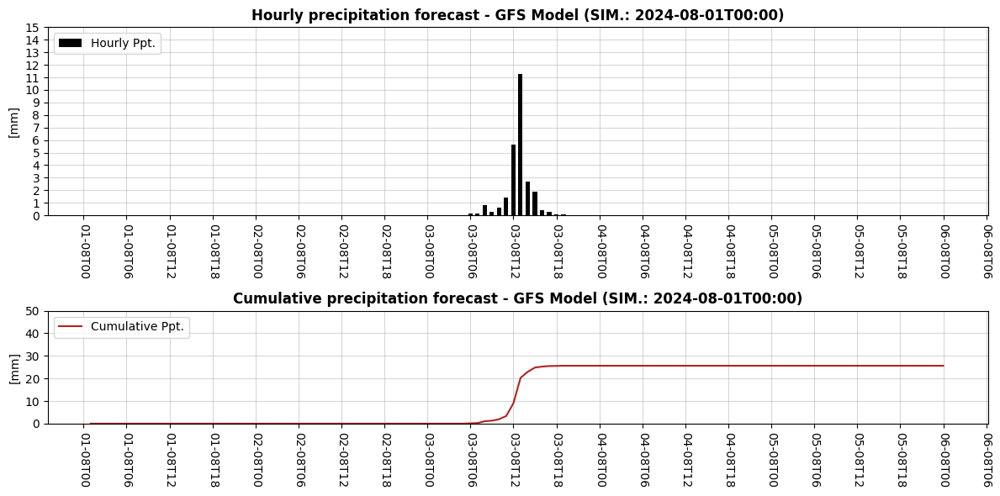

### Project Overview

Greetings! Welcome to the first part of a deep dive into Google Earth Engine (GEE) and its Python API. In this series, we'll explore how to leverage the power of GEE for geospatial analysis, focusing on precipitation forecasting using the **Global Forecast System** (GFS) dataset.

GFS is a widely-used weather forecast model developed by NOAA. It provides comprehensive weather data, including temperature, wind, and precipitation forecasts, on a global scale. The model delivers forecasts up to 16 days into the future, making it an invaluable tool for a wide range of applications.

Moreover, we'll explore the newly released **XEE library**. XEE combines the well-known xarray library with Google Earth Engine, providing powerful tools for handling and analyzing geospatial data.  See more about XEE [here.](https://github.com/google/Xee)

To make this project reproducible, you can access all the code from my [GitHub repository](https://github.com/jm-marcenaro/hugo-posts). Feel free to check it out, try the code yourself, and leave comments or suggestions.

By the end of this tutorial, you'll be able to extract a series of precipitation data at 1-hour intervals and calculate cumulative values for a forecast window of 5 days for your coordinates of interest.

### Analysis

To begin with, we'll import the necessary libraries and set our region of interest (ROI). Since I'm from Argentina, I've chosen region from the city I live in, Buenos Aires, as the focus for this analysis.



```python
# Libraries

import ee
import pandas as pd
import numpy as np
import xarray as xr

from datetime import datetime, timedelta
from tqdm import tqdm

import matplotlib.pyplot as plt
import matplotlib.dates as mdates

ee.Initialize()
#ee.Authenticate() isn't necessary if you've your credentials stored.

COORDs = [
 [-60.09384640, -33.11803785],
 [-56.61465669, -33.11803785],
 [-56.61465669, -35.91630163],
 [-60.09384640, -35.91630163]
]

ROI = ee.Geometry.Polygon(COORDs)
```

Now we'll define our dates of interest. I find it relevant to get the accumulated precipitation from the current date onward. For this, we'll select the simulation that starts at T00, which is the initial run of the day. The GFS model performs four simulations daily at 00:00, 06:00, 12:00, and 18:00 UTC. We'll focus on the T00 run to get the forecast data for our analysis.


```python
# Select the simulation launched at T00 to obtain the accumulated precipitation for the current day

DATE_START = f"{datetime.strftime(datetime.now(), '%Y-%m-%d')}T00:00"

DATE_END = f"{datetime.strftime(datetime.now(), '%Y-%m-%d')}T06:00"
```

Now we'll create an image collection using the region and dates of interest that we've defined previously. For more information on this dataset, you can consult the GEE catalog [here](https://developers.google.com/earth-engine/datasets/catalog/NOAA_GFS0P25#description). Additionally, we'll select the precipitation band and extract the spatial resolution and projection of the data.

To facilitate data management and analysis, we'll convert the image collection to an xarray dataset using the XEE library. This conversion allows us to leverage xarray's powerful capabilities for handling multi-dimensional arrays, making it much easier to manipulate and analyze the dataset.


```python
C_01 = ee.ImageCollection("NOAA/GFS0P25").map(lambda image: image.clip(ROI))\
                                         .filterDate(DATE_START, DATE_END)\
                                         .filterMetadata("forecast_hours", "greater_than", 0)

# Select band of interest
C_01 = C_01.select(["total_precipitation_surface"])

# Get the spatial resolution
OS = C_01.first().projection().nominalScale().getInfo()

# print(f"Original scale: {OS:.1f} m")

# Get projection data
PROJ = C_01.first().select(0).projection()

# Turn the image collection object into a xarray dataset
DS_01 = xr.open_dataset(C_01, engine='ee', crs="EPSG:4326", projection=PROJ, geometry=ROI)

```


Now we'll structure our dataset. First, we'll rename the precipitation band to something more descriptive. Next, we'll slice the dataset to include only the first 120 records. This is because GFS data provides hourly frequency forecasts for the first 5 days. For longer-term forecasts, the data shifts to a 3-hour frequency, which we can exclude since we are'nt interested.

After defining the initial parameters, we'll create a pandas date range starting from **DATE_START** and spanning 120 hours with an hourly frequency.

Next, we update the xarray dataset by assigning our date range **FyH** as the new temporal coordinate, replacing the original time dimension. We then drop the old time variable and introduce a new data array, *FH* (forecast hours), which indexes each forecast hour from 1 to 120. This reorganization makes the dataset more intuitive and easier to work with for further analysis and visualization.



```python
# Rename band
DS_01 = DS_01.rename({"total_precipitation_surface" : "PPT"})

# Filter first 120 registers
DS_01 = DS_01.isel(time=slice(0, 120))

# Create a pandas daterange starting from DATE_START and spanning 120 hours
FyH = pd.date_range(start=DATE_START, freq="1H", periods=120+1)[1:]

DS_01 = DS_01.assign_coords(FyH=("time", FyH))

DS_01 = DS_01.swap_dims({"time" : "FyH"})
                            
DS_01 = DS_01.drop_vars("time")
    
DS_01["FH"] = xr.DataArray(np.arange(1, 121), dims="FyH")
```


Now comes a tricky part. GFS data reports precipitation as cumulative values, resetting every 6 hours. To extract hourly precipitation values, we first create a new data array, **H**, using the modulo operator to identify these 6-hour periods. We then calculate hourly increments by finding the difference between consecutive precipitation values (**PPT_D**). To handle the 6-hour reset accurately, we use the where method as follows: **PPT_D** remains unchanged except where the previous **H** value was zero, in which case **PPT_D** is set equal to **PPT**. This ensures correct hourly precipitation data. Finally we compute the cumulative precipitation for the 5 day period.


```python
# Modula operator. Possible values are 0, 1, 2, 3, 4 and 5
DS_01["H"] = DS_01["FH"] % 6

# One hour increments
DS_01["PPT_D"] = DS_01["PPT"].diff(dim="FyH")

# PPT_D remains the same except where the previous H value was equal to 0
DS_01["PPT_D"] = DS_01["PPT_D"].where(DS_01["H"].shift(FyH=1) != 0, DS_01["PPT"])

# Calculate cumulative ppt along the FyH dimension
DS_01["CUMSUM"] = DS_01["PPT_D"].cumsum(dim="FyH")
```


Next, and nearing the end, we'll convert the dataset into a Pandas dataframe. Specifically, we'll extract precipitation data for specific coordinates of interest within the region we've defined previously. This will yield the precipitation data from the nearest pixel in the dataset to the provided coordinates.


```python
LON, LAT = -58.46633, -34.59960

DF_01 = DS_01.sel(lon=LON, lat=LAT, method="nearest").to_dataframe().drop(columns={"lon", "lat"})
```



### Visualization

As a final step, we'll create a plot to visualize our results using Matplotlib's capabilities. Below is the final piece of code and the corresponding output from our analysis:


```python
fig, ax = plt.subplots(2, 1, figsize=(12, 6), gridspec_kw={"height_ratios" : [1, .6]}, sharex=True)

ax[0].bar(DF_01.index, DF_01["PPT_D"], label="Hourly Ppt.", color="black", zorder=5, width=.025)
ax[0].set_title(f"Hourly precipitation forecast - GFS Model (SIM.: {DATE_START})", fontweight="bold")

# Set y range and ticks
ax[0].set_ylim(0, 15)
ax[0].yaxis.set_ticks(np.arange(0, 15+1, 1))

ax[1].plot(DF_01.index, DF_01["CUMSUM"], label="Cumulative Ppt.", color="firebrick", zorder=5)
ax[1].set_title(f"Cumulative precipitation forecast - GFS Model (SIM.: {DATE_START})", fontweight="bold")

# Set y range and ticks
ax[1].set_ylim(0, 50)
ax[1].yaxis.set_ticks(np.arange(0, 50+10, 10))

# Figure settings along both axis
for i in [0, 1]:

  ax[i].set_ylabel("[mm]")
  ax[i].legend(loc="upper left")
  ax[i].grid(alpha=.5)
  ax[i].tick_params(labelbottom=True)
  ax[i].tick_params(axis="both", which="major")
  DATE_FMT = mdates.DateFormatter('%d-%mT%H')
  ax[i].xaxis.set_major_formatter(DATE_FMT)
  ax[i].xaxis.set_major_locator(mdates.HourLocator(byhour=[0, 6, 12, 18]))
  ax[i].tick_params(axis="x", labelrotation=-90)

fig.tight_layout()
plt.show();
```






### Conclusion

Looks like we might be expecting some heavy rain this weekend, so watch out! I hope this tutorial was useful for understanding how to extract and analyze precipitation data using the GFS dataset in Google Earth Engine and its Python API. In our next article, we'll go one step further by creating spatial maps for a broader region, leveraging the full capabilities of the **XEE** library alongside new tools like **Geopandas** and **Cartopy**. Stay tuned!